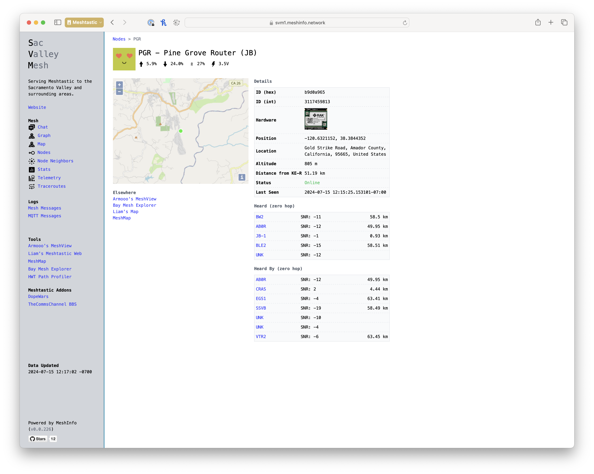

# MeshInfo

Realtime web UI to run against a Meshtastic regional or private mesh network.

[](https://github.com/MeshAddicts/meshinfo/actions/workflows/docker.yml)  

## Overview

MeshInfo is written in Python and connects to an MQTT server that is receiving Meshtastic messages for the purpose of visualizing and inspecting traffic. It (currently) uses a filesystem to persist content, such as node info and telemetry. There are plans to optionally support Postgres and SQLite3 as optional persistance storage methods.

To make deployment to run an instance for your mesh easy, Docker support is included. We recommend using Docker Compose with a personalized version of the `docker-compose.yml` file to most easily deploy it, but any seasoned Docker user can also use the Docker image alone.

If you use MeshInfo and have a publicly accessible instance, we'd like to know! Drop a note to kevin@airframes.io with details and we'll link it below.

See an example instance running on the [Sacramento Valley Mesh](https://svm1.meshinfo.network/nodes.html).

If you are running a high elevation node, preferrably a `Router` or `Repeater` node, you might be interested in getting on the notification list for a [cavity filter](https://shop.airframes.io/products/lora-915mhz-filter) that Kevin and Trevor are having made.

If you're interested in aeronautical (ADS-B/ACARS/VDL/HFDL/SATCOM) or ship tracking (AIS), please take a look at sister project [Airframes](https://airframes.io) / [Airframes Github](https://github.com/airframesio).

## Screenshots

[](meshinfo1.png)
[](meshinfo2.png)
[](meshinfo3.png)
[](meshinfo4.png)
[](meshinfo5.png)

## Supported Meshtastic Message Types

- neighborinfo
- nodeinfo
- position
- telemetry
- text
- traceroute

## Features

### Current

- Chat
- Map
- Nodes
- Node Neighbors
- Mesh Messages
- MQTT Messages
- Telemetry
- Traceroutes

### Upcoming

- Statistics
- Overview of Routes

## Chat

If you're using this and have questions, or perhaps you want to join in on the dev effort and want to interact collaboratively, come chat with us on [#meshinfo on the SacValleyMesh Discord](https://discord.gg/tj6dADagDJ).

## Running

### Docker Compose (preferred for 24/7 servers)

#### Setup

##### Clone the repo

```sh
git clone https://github.com/MeshAddicts/meshinfo.git
cd meshinfo
```

##### Edit Configuration

1. Copy and then edit the `config.json.sample` to `config.json`. 
2. Edit the `Caddyfile` and be sure it is setup for your hostname (FQDN if requiring Let's Encrypt cert to be generated) and your email address for the TLS line.
    
   A. Caddyfile can be customized a few different ways. If you are using a reverse proxy other than Caddy, you can upstream Caddy by changing the `FQDN` to `:80`.

   B. If you only wish to use a self-signed certificate such as in the situation above, and are OK with the browser warnings about this, change TLS line from your email address to `tls internal`.
   
   C. Caddy will request a cert of the FQDN, be sure to specify any subdomain. For example: `https://meshinfo.domain.com`.
      
3. Edit the `docker-compose.yml` (or `docker-compose-dev.yml` if you are going to use that one) and adjust any port mappings for caddy if you wish to have it run on anything other than 80/443. Keep in mind that if you are not using a FQDN and ports 80/443, Caddy will fail to provision a Let's Encrypt certificate. This is because Let's Encrypt requires 80/443 to be accessible and this is not a limitation of Caddy nor MeshInfo.

#### To Run

Change to the directory.

```sh
cd meshinfo
```

```sh
docker compose pull && docker compose down && docker compose up -d && docker compose ps && docker compose logs -f meshinfo
```

#### To Update

```sh
git fetch && git pull && docker compose pull && docker compose down && docker compose up -d && docker compose ps && docker compose logs -f meshinfo
```

### Directly (without Docker)

Be sure you have `Python 3.12.4` or higher installed.

```sh
pip install -r requirements.txt
python main.py
```

## Development

### Building a local Docker image

Clone the repository.

```sh
git clone https://github.com/MeshAddicts/meshinfo.git
```

If already existing, be sure to pull updates.

```sh
git fetch && git pull
```

Build. Be sure to specify a related version number and suffix (this example `dev5` but could be your name or initials and a number) as this will help prevent collisions in your local image cache when testing.

```sh
scripts/docker-build.sh 0.0.1dev5
```

### Running via Docker Compose while developing

```sh
docker compose -f docker-compose-dev.yml up --build --force-recreate
```

You will need to CTRL-C and run again if you make any changes to the python code, but not if you only make changes to
the templates.

### Release

Tag the release using git and push up the tag. The image will be build by GitHub automatically (see: https://github.com/MeshAddicts/meshinfo/actions/workflows/docker.yml).

```sh
git tag v0.0.0 && git push && git push --tags
```

## Contributing

We happily accept Pull Requests!

TODO: Need to rewrite this section.
